***<h1 align="center"> HTML SUMMARY </h1>***

<!-- ## ***`Html Structure`*** -->
***<h2 align="center"> `Html Structure`</h2>***

```html
<!DOCTYPE html>
    <html lang="en">
    <head>
        <title>website title</title>
    </head>
    <body>
        content of website ...
    </body>
</html>
```

***<h2 align="center">`Head`</h2>***

element contains ***machine-readable information*** (metadata => data about data) about the document, like its title, scripts, and style sheets.

medata => Metadata is not displayed.

Metadata typically define the document title, character set, styles, scripts, and other meta information.

* `title` => (required in every HTML document)
* `style`
* `base`
* `link`
* `meta`
* `script`
* `noscript`

### ***<h3>`Title`</h3>***

* title for the page

    ```html
    <title> title descritption</title>
    ```

### ***<h3>`style`</h3>***

* tag style for css internal

    ```html
    <style>
        element-style {
            property: value;
        }
    </style>
    ```

### ***<h3>`link`</h3>***

* for link style css external or favicon or font online

    ```html
    <link rel='stylesheet' href="path/style.css">
    ```

### ***<h3>`FAV icon`</h3>***

* small image displayed next to the title

    ```html
    <link rel="icon" type="image/x-icon" href="sourceImg">
    ```

### ***<h3>`base`</h3>***

* element specifies the base URL to use for all relative URLs in a document

    ```html
    <base href="https://www.example.com/" target="_blank">
    ```

### ***<h3>`script`</h3>***

* tag for link sheet for java script

    ```html
    <script>
        <!-- code javascript -->
    </script>
    <!-- or  -->
    <script src="path/file.js" ></script>
    ```

### ***<h3>`noscript`</h3>***

* tag defines an alternate content to be displayed to users that have disabled scripts in their browser or have a browser that doesn't support script.

### ***<h3>`Meta`</h3>***

* Metadata is data (information) about data.  
typically used to specify character set, page description, keywords, author of the document, and viewport settings.

### ***<h3>`Charset`</h3>***

* Specifies the character encoding for the HTML document

    ```html
    <meta charset="UTF-8"/>
    ```

### ***<h3>`Author`</h3>***

* specifies the author for website

    ```html
    <meta name="author" content="fakhreldin"/>
    ```

### ***<h3>`keywords`</h3>***

* Define keywords for search engines:

    ```html
    <meta name="keywords" content="HTML, CSS, JavaScript"/>
    ```

### ***<h3>`Refresh`</h3>***

* Refresh document every 30 seconds:

    ```html
    <meta http-equiv="refresh" content="30"/>
    ```

### ***<h3>`IE`</h3>***

* used to force Internet Explorer (IE) to use the latest version of the rendering engine. Regardless of the document’s compatibility mode.

    ```html
    <meta http-equiv="X-UA-Compatible" content="IE=edge"> 
    ```

### ***<h3>`viewport`</h3>***

* Setting the viewport to make your website look good on all devices:

    ```html
    <meta name="viewport" content="width=device-width, initial-scale=1.0"/>
    ```

### ***<h3>`review`</h3>***

* tag specifies the date of review of the page ,You can put the date on which you reviewed the page

    ```html
    <meta name="revised" content="Tuesday, July 20th, 2019, 10:15 am" />
    ```

### ***<h3>`copyright`</h3>***

* tag specifies copyright of the page

    ```html
    <meta name="copyright" content="Your Company Or Brand Name" />
    ```

## ***<h2 align="center">`Element specifiy format text`</h2>***

### ***<h3>`strong / b`</h3>***

* make a font weight

    ```html
    <strong>hallo world</strong>
    <b>hallo world</b>
    ```

    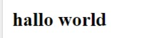
    

### ***<h3>`em / i`</h3>***

* make font italic

    ```html
    <em>hallo world</em>
    <i>hallo world</i>
    ```

    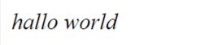
    

### ***<h3>`var`</h3>***

* element represents the name of a ***variable*** in a mathematical expression or a programming context.

    visual same as  italicized ***same(em /i)***

    ```html
    <var>A</var> * <var>B</var> = <var>Z</var>
    ```

    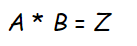

### ***<h4>`deference between (strong / b) (em / i)`</h4>***

* By default, the visual is the same  
***`(em / i)`*** => format text is italic  
***`(strong / b)`*** =>  format text is bold

* ***`but`*** the (em / strong) =>   tag is used to draw the ***voice reader's*** attention to the text and suggests that the enclosed text should be spoken with a higher pitch and with a slightly drawn out and more emphasized voice compared to a regular sentence.  

* ***`on the other hand`***(b / i) is used to render text in an italicized font or bold This doesn't imply any extra emphasis when speaking the text aloud.

### ***<h3>`smap`</h3>***

* samp make font is a defult browser

    ```html
    <samp>hallo world</samp>
    ```

    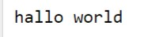

### ***<h3>`code`</h3>***

* tag is used to define a piece of computer code. The content inside is displayed in the browser's default monospace font.

    ```html
    <code>hallo world</code>
    ```

    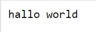

### ***<h3>`Kbd`</h3>***

* element is used to define keyboard input.

    ```html
    <code>hallo world</code>
    ```

    

### ***<h3>`mark`</h3>***

* hilighited text

    ```html
    <mark>hallo world</mark>
    ```

    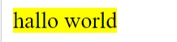

### ***<h3>`q`</h3>***

* make font surrounded quote

    ```html
    <q>hallo world</q>
    ```

    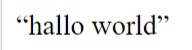

### ***<h3>`blockquote`</h3>***

* tag specifies a section that is quoted from another source.

    ```html
    <blockquote cite="link-for-source">content</blockquote>
    <blockquote cite="https://www.britannica.com/place/Egypt">
        Egypt, country located in the northeastern corner of Africa. Egypt’s heartland, the Nile River valley and delta, was the home of one of the principal civilizations of the ancient Middle East and, like Mesopotamia farther east,
    </blockquote>
    ```

    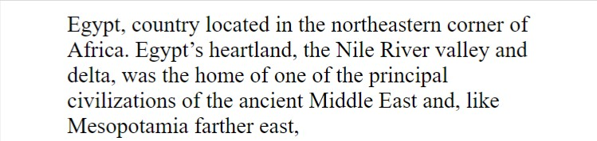

### ***<h3>`abbr`</h3>***

* tag defines an abbreviation or an acronym  

    user ***hover*** on abbreviation for show title what is the mean

    ```html
    <abbr title="hallo world">hallo world</abbr>
    <abbr title="Hyper text markup language">HTML</abbr>
    ```

    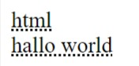

### ***<h3>`small`</h3>***

* for smaller text

    ```html
    <p>hallo world</p>
    <small>hallo world</small>
    ```

    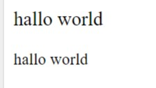

### ***<h3>`u / ins`</h3>***

* ***u / ins*** make the same thing  
make font underline text

    ```html
    <ins>hallo world</ins>
    <u>hallo world</u>
    ```

    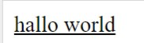

### ***<h3>`del`</h3>***

* make font throwline text

    ```html
    <u>hallo world</u>
    ```

    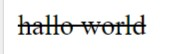

### ***<h3>`sub`</h3>***

* tag defines subscript tex

    ```html
    H<sub>2</sub>o
    ```

    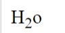

### ***<h3>`sup`</h3>***

* tag defines superscript text

    ```html
    <sup>hallo world</sup>
    ```

    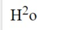

### ***<h3>`button`</h3>***

* tag defines superscript text

    ```html
    <button>submit</button>
    ```

    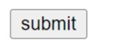

### ***<h3>`wbr/ br`</h3>***

* ***br*** => used to a break line  

* ***wbr*** use inside word has many letters or link for the  

* example,  
when become the screen is small the word or link will become in a two lines

    ```html
    <div>screenshots</div>
    <div>screen<br/>shots</div>
    <div>screen<wbr/>shots</div>
    ```


    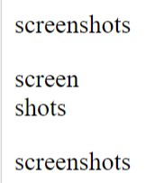

    when the screen samll ,wbr make a break line because the width of screen is not enough for word

    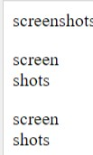

### ***<h3>`hr`</h3>***

* Horizontal Rule

    ```html
    <hr/>
    ```

    

### ***<h3>`bdo`</h3>***

* used to override the current text direction.

    ```html
    <bdo dir="ltr">hallo world</bdo> <br />
    <bdo dir="rtl">hallo world</bdo> <br />
    <div>الحمدالله.</div>
    <bdo dir="rtl"> الحمدالله.</bdo> <br />
    <bdo dir="ltr"> الحمدالله.</bdo> <br />
    ```

    

### ***<h3>`bdi`</h3>***

* element tells the browser's bidirectional algorithm to treat the text it contains in isolation from its surrounding text.

    ```html
    <h1>Top of the classs</h1>
    <ul>
        <li>fakhr :1st</li>
        <li>ali :2nd</li>
        <li>محمد :3rd</li>
        <li>سما :4th</li>
        <li><span>ساره</span>:2nd</li>
    </ul>
    <h1>Top of the classs</h1>
    <ul>
        <li>fakhr :1st</li>
        <li><bdi>ساره</bdi>:2nd</li>
        <li><span dir="auto">ساره</span>:3rd</li>

    </ul>

    ```

    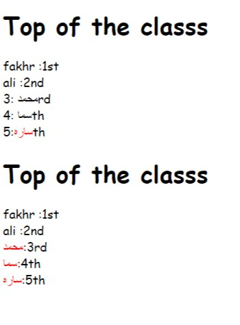

### ***<h3>`pre`</h3>***

* defines preformatted text.

    ```html
    <div>
        Text in a pre element

    is displayed in a      fixed-width
    font, and it preserves
    both      spaces and
    line breaks
    </div>
    <pre>
        Text in a pre element

    is displayed in a fixed-width
    font, and it preserves
    both      spaces and
    line breaks
    </pre>
    ```

    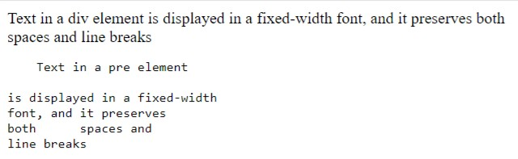

### ***<h3>`iframe`</h3>***

* tag specifies an inline frame.

    ```html
    <iframe src="url" title="description"></iframe>
    <!-- example -->
    <iframe src="https://example.com" height="200" width="300" title="frame Example"></iframe>
    ```

## ***<h2 align="center">`Links`</h2>***

* link website or mention section in page

    ```html
    <!-- absolute link -->
    <a href="link url"> press here to go link</a> <br />
    <!-- relative link-->
    <a href="#idSection"> press here to go section</a> <br />
    <a href="pageHTML"> press here to go page</a> <br />
    <!-- for connect with email-->
    <a href="mailto:example@gmail.com"> press here to go email</a> <br />
    ```

    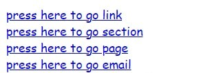

***<h3>`target`</h3>***

 attribute specifies where to open the linked document.

* ***`_blank`***
  * in the same window
* ***`_self`***
  * in a new window or tab
* ***`_parent`***
  * in the parent frame
* ***`_top`***
  * in the parent frame

***<h3>`Link colors`</h3>***

by `default` , link will appear like.

* An `unvisited` link is underlined and blue
* A `visited` link is underlined and purple
* An `active` link is underlined and red

change color by using CSS.

* ***`a:link`***
  * style general
* ***`a:visited`***
  * if open link or visited with click
* ***`a:hover`***
  * when a hover with mouth
* ***`a:active`***
  * when a click a link

## ***<h2 align='center'>`Imgae`</h2>***

### ***<h3>`img`</h3>***

* link any image on wesite or image stored in computer or server

    ```html
    <!-- absoludte link -->
    
    <!-- relateive link-->
    
    ```

### ***<h3>`picture`</h3>***

* There are two main purposes for the :
  * Bandwidth (عرض النطاق)

    the image will be different Depending on the width of the device from one device to another

    ```html
    <picture>
        <source media="(min-width: 600px)" srcset="img2.jpg">
        <source media="(min-width: 992px)" srcset="img1.jpg">
        
    </picture>
    ```

  * support format

    Some browsers or devices may not support all image formats.

    ```html
    <picture>
        <source srcset="imgFord.png">
        <source srcset="imgBmw.jpg">
        
    </picture>
    ```

    ***NOTE***  
    * Always specify an `img` element as the last child element of the `picture` element, img show if tags of picuture not match  

### ***<h3>`Image map`</h3>***

* tag defines an image map. An image map is an image with clickable areas

    ```html
    
    <map name="name-map">
        <area shape="????" coords="???" alt="???" href="src">
        <area shape="????" coords="???" alt="???" href="src">
        <area shape="????" coords="???" alt="???" href="src">
    </map>
    ```

* ***`usemap`***
  * used to create a relationship between the image and the image map.
* ***`map`***
  * used to create an image map.
  * linked to the image by using attr name.
* ***`area`***
  * defined A clickable area.
* ***`shape`***
  * attr define the shape of the clickable area
  * `value`
    * rect
      * rectangular region
    * circle
      * circular region
    * poly
      * defines a polygonal region
    * default
      * defines a polygonal region
* ***`coords`***
  * specifies the coordinates of an area in an image map.
* ***`href`***
  * link to go after click area.

## ***<h2 align="center">`Audio`</h2>***

* link any audio on wesite or audio stored in computer or server

    ```html
    <!-- way one -->
    <audio src="link audio online or locate in server"></audio>
    <!--  specifies one or more media resources -->
    <audio >
        <source src="link audio online or locate in server1">
        <source src="link audio online or locate in server2">
    </audio>
    <!-- example -->
    <audio>
        <source src="audio.mp3" type="audio/mpeg"/>
        <source src="audio.ogg" type="audio/ogg" />
    </audio>
    <!-- attr for audio => (controls / autoplay / muted / loop ) -->
    ```

## ***<h2 align="center">`Video`</h2>***

* link any video on wesite or video stored in computer or server

    ```html
        <!-- way one -->
    <video src="link video online or locate in server"></video>
    <!--  specifies one or more media resources -->
    <video >
        <source src="link video online or locate in server1">
        <source src="link video online or locate in server2">
    </video>
    <!-- example -->
    <video>
        <source src="video.webm" type="video/webm"/>
        <source src="video.mp4" type="video/mp4" />
    </video>
    <!-- attr for video => (controls / autoplay muted / loop ) -->
    ```

## ***<h2 align='center'>`lists`</h2>***

### ***<h3>`Order lists`</h3>***

* ol li

    ```html
    <ol>
        <li>html</li>
        <li>css</li>
        <li>javascript</li>
    </ol>
    ```

    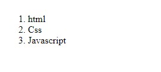

### ***<h3>`Unorder lists`</h3>***

* ul li

    ```html
    <ul>
        <li>html</li>
        <li>css</li>
        <li>javascript</li>
    </ul>
    ```

    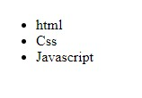

### ***<h3>`other list lists`</h3>***

* dl dt dd

    ```html
    <dl>
        <dt>html</dt>
            <dd>hyper text markup language</dd>
        <dt>CSS</dt>
            <dd>Cascading style sheet</dd>
        <dt>JS</dt>
            <dd>JavaScript</dd>
    </dl>
    ```

    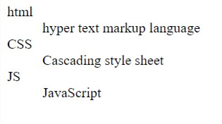

## ***<h2 align="center">`table`</h2>***

### ***table _stracture***

* table structure

    ```html
    <table>
        <colgroup>
            <col span="2" style="background-color:red">
            <col style="background-color:yellow">
        </colgroup>
        <caption> title for table</caption>
        <thead>
            <tr>
                <th></th>
                <th></th>
            </tr>
        </thead>
        <tbody>
            <tr>
                 <td></td>
                <td></td>
            </tr>
            <tr>
                <td></td>
                <td></td>
            </tr>
        </tbody>
        <tfoot>
            <tr>
                <td></td>
                <td></td>
            </tr>
        </tfoot>
    </table>
    ```

* ***`colgroup`***  =>  select style for column or more.
* ***`caption`***  =>   the title of table  
* ***`thead`***    =>   the first row  
* ***`tbody`***    =>   the rows in the middle  
* ***`tfoot`***    =>   the last row in table  

* ***`tr`***      >>> table row  
* ***`td`***      >>> table data cells  
* ***`th`***      >>> table data cells for head  

### ***`Attribute for combine between cells`***

* ***`rowspan`***="number cells"    >>>  في حاله دمج خليه في اكثر من صف  
* ***`colspan`***="number cells"    >>>  في حاله دمج خليه في اكثر من صف  

    ```html
    <tr>
        <td rowspan="2"> content </td>
        <td colspan="2"> content </td>
    </tr>
    ````

***<h3>`colgroup`</h3>***  

* colgroup  => when you combine alot of colom same of style
* ***`NOTE`*** to hide column using property visibility: collapse

    ```html
    <table width="50%">
        <colgroup>
            <col style="background-color: yellow" />
            <col style="background-color: orange" />
            <col span="2"style="background-color: blue" />
        </colgroup>
        <tr>
            <th>name</th>
            <th>title</th>
            <th>salary</th>
            <th>salary</th>
        </tr>
        <tr>
            <td>mhmd</td>
            <td>manager</td>
            <td>$53</td>
            <td>5300</td>
        </tr>
        <tr>
            <td>michel</td>
            <td>manager</td>
            <td>$49</td>
            <td>4900</td>
        </tr>
        </table>
    ```

    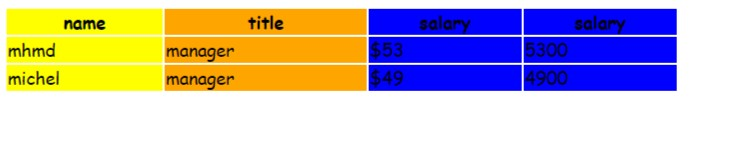

## ***<h2 align='center'>`semantic elements`</h2>***

`div` =>  is a generic block

***there exist a lot a elements block and has Expressive name***

* ***`header`***
* ***`nav`***
* ***`aside`***
* ***`section`***
* ***`article`***
* ***`footer`***
* ***`figure`***
* ***`figcaption`***
* ***`details`***
* ***`...`***

## ***<h2 align='center'>`block and inline`</h2>***

***<h3>`Block`</h3>***

* Take Full Width If No Width
* Add Line Break
* Respect Padding, Margin, Width, Height

***<h3>`Inline`</h3>***

* Do Not Repsepct Width, Height
* Respect Padding And Margin [ Just Right + Left ]
* Do Not Add Line Break
* Allow Elements Before And After It in The Same Line

***<h3>`Inline-Block`</h3>***

* Allow Elements Before And After It in The Same Line
* Respect Padding, Margin, Width, Height

## ***<h2 align='center'>`Form`</h2>***

elements for form

* `label`
* `input`
* `select`
  * option
  * optgroup
* `textarea`
* `button`
* `fieldset`
  * legend
* `datalist`
* `output`

## ***<h2 align="center">`label`</h2>***

* it is the title for input , select ,textarea ...

    ```html
    <label for="id-input"> title for input </label>
    ```

## ***<h2 align='center'>`input type="????"`</h2>***

### ***`button`***

* specifies a clickable button

    ```html
    <input type="button" value="button">
    ```

    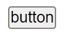

### ***`checkbox`***

* defines a checkbox.

    user select one or more options of a limited number of choices

    ```html
    <input id="cbhtml" type="checkbox"> 
    <label for="cbhtml">html</label>
    ```

    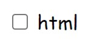
    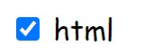

### ***`radio`***

* specifies a radio button

    user select only one choice

    ```html
    <input type="radio">
    ```

    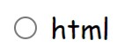
    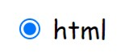

### ***`color`***

* allow you choice color

    ```html
    <input type="color">
    ```

    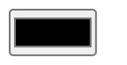

### ***`text`***

* allow enter data

    ```html
    <label for="fname">first name</label>
    <input id="fname" type="text"> 
    ```

    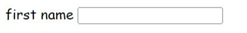

### ***`email`***

* specifies input for an e-mail address.

    ```html
    <label for="email">email</label>
    <input id="email" type="email">
    ```

    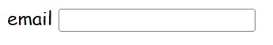

### ***`password`***

* specifies for password

    ```html
    <label for="pass">password</label>
    <input id="pass" type="password"> 
    ```

    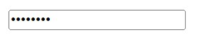

### ***`file`***

* for choice file

    ```html
    <input type="file">
    ```

    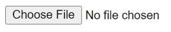

### ***`hidden`***

* input is hidden

    ```html
    <input type="hidden">
    ```

### ***`image`***

* specifies the image a submit button

    ```html
    <input type="image" alt="Sumbit" src="imgs/inImg.png">
    ```

    

### ***`date`***

* specifies the date picker >> include ( year / month / day )

    ```html
    <input type="date">
    ```

    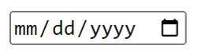

### ***`datetime-local`***

* specifies the date >> include ( year / month / day / time )

    ```html
    <input type="datetime-local">
    ```

    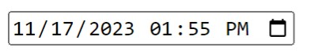

### ***`time`***

* specifies a control for entering a time (no time zone).

    ```html
    <input type="time">
    ```

    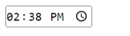

### ***`month`***

* specifies the month and year control

    ```html
    <input type="month">
    ```

    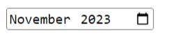

### ***`week`***

* specifies a week and year control

    ```html
    <input type="week">
    ```

    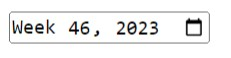

### ***`number`***

* specifies enter number

    ```html
    <input type="number" min="0" max="100" step="1" value="14">
    ```

    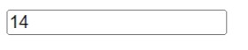

### ***`range`***

* specifies a control for entering a number whose exact value is not important

    ```html
    <input type="range" min="0" max="100" step="1" value="14">
    ```

    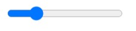

### ***`search`***

* for entering a search string

    ```html
    <input type="search">
    ```

    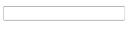

### ***`reset`***

* resets all form values to its initial values.

    ```html
    <input type="reset" value="Reset">
    ```

    

### ***`submit`***

* submit

    ```html
    <input type="submit">
    ```

    

### ***`tel`***

* specifies for entering tel number

    ```html
    <input type="tel">
    ```

    

### ***`url`***

* spcifies for entering a url

    ```html
    <input type="url">
    ```

    

## ***<h2 align="center">`attribute for form`</h2>***

### `action`

* specifies where to send the form-data

### `target`

* specifies if form open in new window or noo.
* values
  * `_self`
  * `_blank`
  * `_parent`
  * `_top`
  * `framename`

### `method`

* specifies how to send form-data
* values
  * `get`
  * `post`

### `novalidate`

* it specifies that the form-data (input) should not be validated when submitted.

### `autocomplete`

* autocomplete inputs on or off
* value
  * `on`

### `enctype`

* specifies how the form-data should be encoded when submitting it to the server.
* `values`
  * `application/x-www-form-urlencoded`
    * default All characters are encoded before sent,
  * `multipart/form-data`
    * This value is necessary if the user
  * `text/plain`
    * Sends data without any encoding at all. Not recommended

### `name`

* specifies the name of a form

## ***<h2 align="center">` attribute for input`</h2>***

### `value`

* attribute specifies the value of an **input** element

* ***`used differently for different input types` :***

  1. `For` "button", "reset", and "submit" - it defines the text on the button

      ```html
      <input type="reset" value="reset">
      ```

        

  2. `For` "text", "password", and "hidden" - it defines default value of the input field

      ```html
      <input type="text" value="hallo world">
      ```

      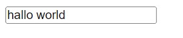

  3. `For` "checkbox", "radio", "image" - it defines the value associated with the input (this is also the value that is sent on submit)

      ```html
      <input id="cbhtml" type="checkbox" value="html"> 
      <label for="cbhtml">html</label>
      ```

      

  4. ***`NOTE`*** cannot be used with  type="file"

### `placeholder`

* attribute specifies a short hint that describes the expected value of an input

    ```html
    <input type="text" placeholder="write your name">
    ```

    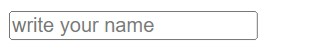

### `required`

* it specifies that an input field must be filled out before submitting the form.

### `name of input`

* is  used as a reference when the data is submitted.

### `hidden_`

* hidden the input

### `readonly`

* specifies the element is read-only.
* `will be sent` when submitting the form!.

* cannot modified

    ```html
    <input type="text" value="hallo world" readonly>
    ```

    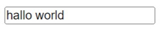

### `disabled`

* specifies the element is disabled  
* `will not be sent` when submitting the form

    cannot modified

    ```html
    <input type="text" value="hallo world" disabled>
    ```

    

### `autofocus`

* specifies the element input focus automatically when the page loads

### `autocompelete`

* specifies the input should have auto autocomplete on or off

### `maxlength`

* specifies the maximum number of characters in inputs

### `minlength`

* specifies the minmum number of characters in inputs

### `size`

* specifies the visible width, in characters.

### `pattern`

* specifies a regular expression that the input field's value
* works with the input types: `text`, `date`, `search`, `url`, `tel`, `email`, and `password`.

### `height ` and `width`

* s specify the height and width of an `input type="image"` element.

### `list`

* attribute refers to a `datalist` element that contains pre-defined options

```html
<form>
    <input list="cars" >
    <datalist id="cars">
        <option value="ford"/>
        <option value="Bmw"/>
        <option value="benz"/>
        <option value="volvo"/>
        <option value="verna"/>
    </datalist>
</form>
```


## ***<h2 align='center'>`attr for some inputs`</h2>***

(range / number / time / date / datetime-local / month / week )

### `min`

* specifies the minimum value

### `max`

* specifies the minimum value

### `step`

* specifies the interval between legal numbers.
* input number.

### `value`

* specifies the default value will be disable

## ***<h2 align="center">`Attr for file`</h2>***

### `accept`

* specifies files accepet

    ```html
    <input type="file" accept=".pdf , .word">
    ```

### `multiple `

* specifies that the user is allowed to enter more than one value
* works with the input types: `email`, and `file`

    ```html
    <input type="file" accept=".pdf , .word" multiple >
    ```

### ***<h2 align="center">`attr for (checkbox / radio)`</h2>***

### `checked`

* specifies that an input element should be pre-selected (checked) when the page load

## ***<h2 align="center">`Attr for input Submit`</h2>***

### `formaction`

* specifies the URL of the file that will process the input control  

    when the form is submitted.

### `formenctype`

* specifies how the form-data should be encoded when
submitting it to the server  
* ***NOTE*** used with type="submit" and type="image"

    *value is :*

  * `application/x-www-form-urlencoded` => Default.  
All characters are encoded before sent

  * `multipart/form-data`  
This value is necessary if the user will upload a file through the form

  * `text/plain` 
Sends data without any encoding at all. Not recommended

### `formmethod`

* defines the HTTP method for sending form-data

    *value is :*

  * `get`
  * `post`

### `formnovalidate`

* specifies that the input element should not be validated when submitted.
* value
  * formnovalidate

### `formtarget`

* specifies a name or a keyword that indicates where to display the response that is received after submitting the form.
* value
  * _blank

## ***<h2 align="center">`select`</h2>***

***used to create a drop-down list***

### ***`structure`***

* used to create dropdown list

    ```html
    <label for="cars">Choose a car:</label>

    <select name="cars" id="cars">
        <option value="ford">ford</option>
        <option value="Bmw">Bmw</option>
        <option value="mercedes">Mercedes</option>
        <option value="audi">Audi</option>
    </select>
    ```

    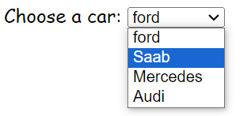

### `optgroup`

* used to create related options in drop down

    ```html
    <label for="cars">Choose a car:</label>
    <select  name="cars" id="cars">
        <optgroup label="American Cars">
            <option value="Ford">ford</option>
            <option value="dodge">dodge</option>
            <option value="Ram">Ram</option>
        </optgroup>
        <optgroup label="German Cars">
            <option value="mercedes">Mercedes</option>
            <option value="audi">Audi</option>
            <option value="Bmw">Bmw</option>
        </optgroup>
    </select>
    ```

    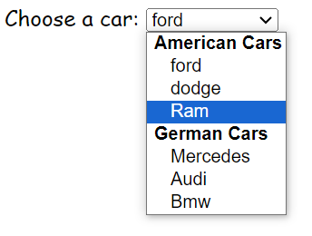

## ***<h2 align="center">`textarea`</h2>***

* defines a multi-line text input control like comments or reviews.

    ```html
    <label for="Sub">subject</label>
    <textarea name="Sub" id="Sub" cols="30" rows="10" placeholder="write anything"></textarea>
    ```

    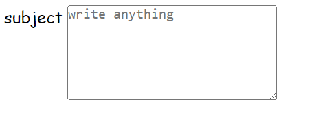

## ***<h2 align="center">`datalist`</h2>***

* specifies a list of pre-defined options for an input element

    ```html
    <label for="browser">Choose your browser from  list:</label>
    <input list="browsers" name="browser" id="browser">

    <datalist id="browsers">
        <option value="Edge">
        <option value="Firefox">
        <option value="Chrome">
        <option value="Opera">
        <option value="Safari">
    </datalist>
    ```

    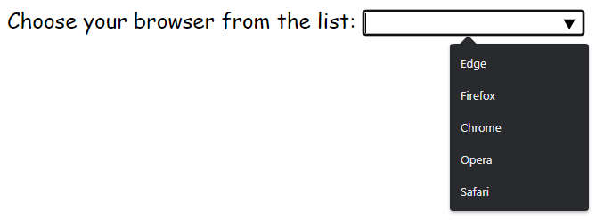

## ***<h2 align="center">`fieldset`</h2>***

* is used to group related elements in a form.

draws a box around the related elements.

### `legend`

* `caption` for the fieldset element.

    ```html
    <fieldset>
        <legend>sign in</legend>
        <label for="uname"> first name</label>
        <input type="text" id="uname" placeholder="enter username"> <br/>
        <label for="emials"> your email</label>
        <input type="email" id="emails" name="email" placeholder=" enter e-mail or phone">
    </fieldset>
    ```

    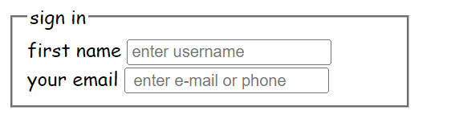

## ***<h2 align="center">`progress`</h2>***

* ### `progress` bar

    ```html
    <progress value="30" max="100"></progress>
    <progress value="70" max="100"></progress>
    ```

    
    
